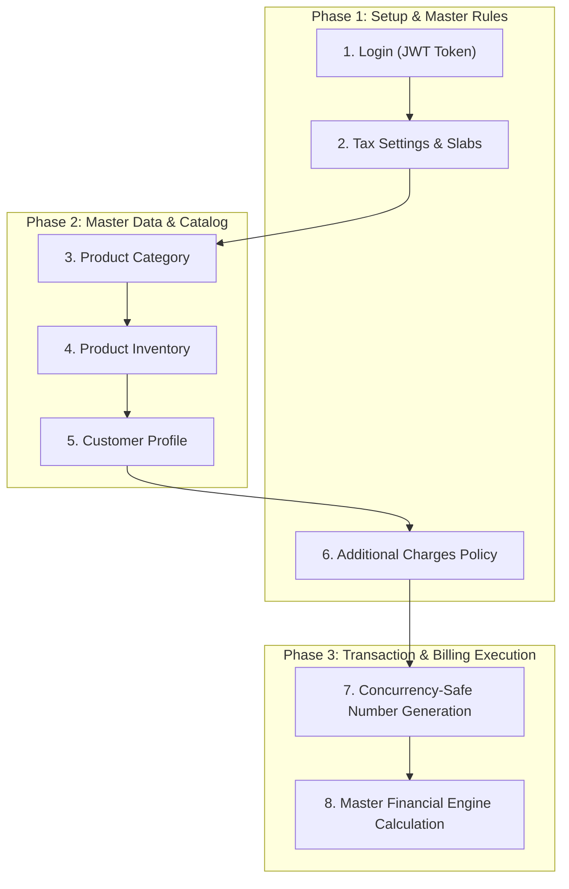

# IBMS Billing System: End-to-End API Workflow & Testing Guide

This document provides the complete, chronological workflow of the **IBMS Billing Engine APIs**. It details every API executed, its business purpose, request payloads, and the deterministic financial calculation logic from authentication to final checkout.

---

## 1. System Architecture & Workflow Overview

In an enterprise ERP/Billing system, transactions do not happen in isolation. Master business rules, tax rates, inventory catalogs, and customer profiles must exist before an official tax invoice can be generated.



---

## 2. Detailed Step-by-Step API Specification

### Step 1: User Authentication & Session
* **HTTP Method & URL**: `POST /api/auth/login`
* **Headers**:
  ```http
  Content-Type: application/json
  ```
* **Request Payload**:
  ```json
  {
    "email": "superadmin@ibms.com",
    "password": "SuperAdmin@123!"
  }
  ```
* **Business Purpose (Why we use this API)**:
  - Enforces role-based access control (RBAC) and tenant data isolation.
  - Generates the JWT Bearer token required in the `Authorization: Bearer <token>` header for all subsequent billing and configuration endpoints.
* **Expected Response**: `200 OK` containing `token`, `tenantId`, `roles`, and user profile data.

---

### Step 2: Tax Slabs & Configuration
* **HTTP Method & URL**: `POST /api/v1/settings/taxes/rates`
* **Headers**:
  ```http
  Authorization: Bearer <token>
  Content-Type: application/json
  ```
* **Request Payload**:
  ```json
  {
    "name": "GST 18%",
    "code": "GST_18",
    "taxType": "GST",
    "rate": 18.0,
    "description": "Standard GST 18% for Electronics and Peripherals",
    "isCompound": false,
    "isInclusive": false,
    "applicationLevel": "Item",
    "priority": 1,
    "effectiveFrom": "2026-01-01T00:00:00.000Z",
    "effectiveTo": null,
    "status": "Active"
  }
  ```
* **Business Purpose (Why we use this API)**:
  - Legally, invoices cannot calculate taxes without official tax slabs.
  - This API creates a reusable 18% GST master rate (`id: 6`, `code: "GST_18"`) that is subsequently assigned to product inventory and referenced during tax calculations.
* **Expected Response**: `201 Created` with generated tax rate `id`.

---

### Step 3: Product Category Catalog
* **HTTP Method & URL**: `POST /api/v1/categories`
* **Headers**:
  ```http
  Authorization: Bearer <token>
  Content-Type: application/json
  ```
* **Request Payload**:
  ```json
  {
    "name": "Computer Hardware",
    "description": "Laptops, Desktops, Keyboards, Mice and Peripherals",
    "status": "Active"
  }
  ```
* **Business Purpose (Why we use this API)**:
  - Organizes store inventory into structured groups.
  - Enables category-based financial reporting, tax classification, and search/filtering across thousands of inventory items.
* **Expected Response**: `201 Created` with category `id` and active status.

---

### Step 4: Product Inventory Registration
* **HTTP Method & URL**: `POST /api/v1/products`
* **Headers**:
  ```http
  Authorization: Bearer <token>
  Content-Type: application/json
  ```
* **Request Payload**:
  ```json
  {
    "productCode": null,
    "name": "Logitech Wireless Mouse M331",
    "description": "Silent optical wireless mouse with 2.4GHz USB receiver",
    "type": "Product",
    "category": "Computer Hardware",
    "unit": "Piece",
    "price": 1200.00,
    "currency": "INR",
    "taxCategory": "Standard",
    "hsnSacCode": "8471",
    "hsnSac": "8471",
    "discountAllowed": true,
    "discountPercent": 10.0,
    "discount": 10.0,
    "discountPercentage": 10.0,
    "status": "Active"
  }
  ```
* **Business Purpose (Why we use this API)**:
  - Registers the sellable item into the tenant inventory.
  - Links the item to its Category (`"Computer Hardware"`), HSN Code (`"8471"`), standard unit price (₹1,200.00), and max permissible item discount (10%).
* **Expected Response**: `201 Created` with auto-generated atomic `productCode` (e.g. `PRD-0001`).

---

### Step 5: Customer Profile Management
* **HTTP Method & URL**: `POST /api/v1/customers`
* **Headers**:
  ```http
  Authorization: Bearer <token>
  Content-Type: application/json
  ```
* **Request Payload**:
  ```json
  {
    "customerCode": null,
    "name": "Rahul Sharma",
    "email": "rahul.sharma@example.com",
    "phone": "9876543210",
    "companyName": "Sharma Tech Enterprises",
    "customerType": "Individual",
    "taxId": "36AAAAA9999Z1Z1",
    "address": "Plot 42, Hitech City Main Road",
    "city": "Hyderabad",
    "state": "Telangana",
    "postalCode": "500081",
    "country": "India",
    "website": "https://sharmatech.in",
    "notes": "Regular corporate customer",
    "currency": "INR",
    "paymentTerms": "Net 30",
    "addresses": [
      {
        "id": 0,
        "addressType": "Billing",
        "addressLine1": "Plot 42, Hitech City Main Road",
        "addressLine2": "Near Cyber Towers, Madhapur",
        "city": "Hyderabad",
        "state": "Telangana",
        "postalCode": "500081",
        "country": "India",
        "isDefault": true
      }
    ]
  }
  ```
* **Business Purpose (Why we use this API)**:
  - Records customer identification, billing address, and GSTIN.
  - **Crucial for Indian GST**: The customer's state (`"Telangana"`) matching the tenant's state (`"Telangana"`) triggers **Intra-State GST**, automatically splitting 18% GST into **CGST (9%) + SGST (9%)**. If states differ, the engine applies **IGST (18%)**.
* **Expected Response**: `200 OK` with allocated `customerCode` and customer record.

---

### Step 6: Additional Charges Configuration (Shipping / Extra Fees)
* **HTTP Method & URL**: `POST /api/v1/settings/charges`
* **Headers**:
  ```http
  Authorization: Bearer <token>
  Content-Type: application/json
  ```
* **Request Payload**:
  ```json
  {
    "name": "Standard Express Shipping",
    "code": "SHIP_EXP",
    "description": "Ground delivery within 2-3 business days",
    "chargeType": "Shipping",
    "calculationType": "Fixed",
    "amount": 75.0,
    "minInvoiceAmount": 500.0,
    "maxChargeAmount": 200.0,
    "isTaxable": true,
    "taxCategory": "Standard",
    "status": "Active"
  }
  ```
* **Business Purpose (Why we use this API)**:
  - Stores tenant-wide delivery, packaging, or handling fee rules.
  - Establishes business policies (e.g. ₹75 flat fee, minimum invoice threshold of ₹500, and taxable flag so tax is properly levied on shipping services).
* **Expected Response**: `201 Created` with charge rule `id`.

---

### Step 7: Concurrency-Safe Invoice Number Generation
* **HTTP Method & URL**: `POST /api/v1/settings/numbering/generate`
* **Headers**:
  ```http
  Authorization: Bearer <token>
  Content-Type: application/json
  ```
* **Request Payload**:
  ```json
  {
    "documentType": "Invoice",
    "transactionDate": "2026-09-21T00:00:00.000Z"
  }
  ```
* **Business Purpose (Why we use this API)**:
  - Tax laws strictly prohibit duplicate or missing invoice sequence numbers.
  - Implements atomic pessimistic/database sequence locking (`IncrementSequenceAsync`), ensuring that multiple concurrent cashiers never generate conflicting numbers.
* **Expected Response**: `200 OK`
  ```json
  {
    "success": true,
    "message": "Number generated successfully.",
    "data": {
      "documentType": "Invoice",
      "generatedNumber": "INV-2026-0001",
      "sequenceNumber": 1,
      "generatedAtUtc": "2026-09-21T04:40:00.000Z"
    }
  }
  ```

---

### Step 8: Master Financial Calculation Engine (Checkout Execution)
* **HTTP Method & URL**: `POST /api/v1/financial/calculate`
* **Headers**:
  ```http
  Authorization: Bearer <token>
  Content-Type: application/json
  ```
* **Request Payload**:
  ```json
  {
    "items": [
      {
        "name": "Logitech Wireless Mouse M331",
        "productCode": "PRD-0001",
        "unitPrice": 1200.0,
        "quantity": 2,
        "lineDiscountType": "Percentage",
        "lineDiscountValue": 10.0,
        "taxRateId": 6,
        "taxCode": "GST_18",
        "taxRatePercent": 18.0,
        "isTaxInclusive": false
      }
    ],
    "invoiceDiscount": {
      "discountType": "Percentage",
      "value": 5.0,
      "ruleCode": "SPECIAL5",
      "overrideReason": "Customer loyalty discount"
    },
    "charges": [
      {
        "name": "Standard Delivery",
        "chargeCode": "SHIP_STD",
        "chargeType": "Shipping",
        "calculationType": "Fixed",
        "amount": 60.0,
        "isTaxable": true,
        "taxRatePercent": 18.0
      }
    ],
    "transactionDate": "2026-09-21T04:43:53.778Z",
    "pricesIncludeTax": false,
    "currency": "INR"
  }
  ```
* **Business Purpose (Why we use this API)**:
  - Serves as the central computing engine for the entire billing system.
  - Combines line items, item discounts, order coupons, tax components, and delivery charges in a strict, deterministic mathematical sequence.
* **Deterministic Calculation Flow**:
  1. **Line Gross**: $2 \times ₹1,200.00 = \mathbf{₹2,400.00}$
  2. **Line Item Discount (10%)**: $10\% \text{ of } ₹2,400.00 = -\mathbf{₹240.00} \rightarrow \text{Line Net} = ₹2,160.00$
  3. **Order-Level Discount (5%)**: $5\% \text{ of } ₹2,160.00 = -\mathbf{₹108.00} \rightarrow \text{Taxable Base} = ₹2,052.00$
  4. **Product GST (18%)**: $18\% \text{ on } ₹2,052.00 = +\mathbf{₹369.36}$
  5. **Additional Shipping Charge**: $+\mathbf{₹60.00}$
  6. **Tax on Shipping Charge (18%)**: $18\% \text{ on } ₹60.00 = +\mathbf{₹10.80}$
  7. **Grand Total Customer Payable**:
     $$₹2,052.00 + ₹369.36 + ₹60.00 + ₹10.80 = \mathbf{₹2,492.16}$$
* **Expected Response**: `200 OK` containing full component breakdown and final `grandTotal: 2492.16`.

---

## 3. Standardized Error Handling Architecture (IBMSBE-020)

Every API in the system adheres to the standardized envelope pattern:

### Success Envelope
```json
{
  "success": true,
  "message": "Operation completed successfully.",
  "data": { ... },
  "errors": null,
  "errorCode": null
}
```

### Validation / Error Envelope
```json
{
  "success": false,
  "message": "One or more validation errors occurred.",
  "errors": [
    "Product price must be a non-negative number.",
    "Category name is required."
  ],
  "errorCode": "VALIDATION_ERROR",
  "traceId": "00-4bf92f3577b34da6a3ce929d0e0e4736-00"
}
```

---

## 4. Summary Matrix of Tested APIs

| Order | Module | HTTP Method & Endpoint | Core Input | Key Business Output |
|---|---|---|---|---|
| **1** | **Auth** | `POST /api/auth/login` | Email, Password | Bearer JWT Token |
| **2** | **Taxes** | `POST /api/v1/settings/taxes/rates` | 18% Rate, Code `GST_18` | Persistent Tax Rate `id: 6` |
| **3** | **Catalog** | `POST /api/v1/categories` | Name: `"Computer Hardware"` | Category created |
| **4** | **Inventory**| `POST /api/v1/products` | Logitech Mouse, ₹1,200 | Product `PRD-0001` created |
| **5** | **Customer** | `POST /api/v1/customers` | Rahul Sharma, Telangana | Customer profile & GST state |
| **6** | **Charges** | `POST /api/v1/settings/charges` | Standard Shipping, ₹75 | Persistent Shipping Rule |
| **7** | **Numbering**| `POST /api/v1/settings/numbering/generate`| DocType: `"Invoice"` | Atomic `INV-2026-0001` |
| **8** | **Financial**| `POST /api/v1/financial/calculate` | Cart Items, Coupons, Taxes | Final Bill: **₹2,492.16** |

---
*Document generated for IBMS Billing System Backend & QA Teams.*
